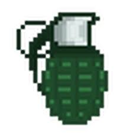
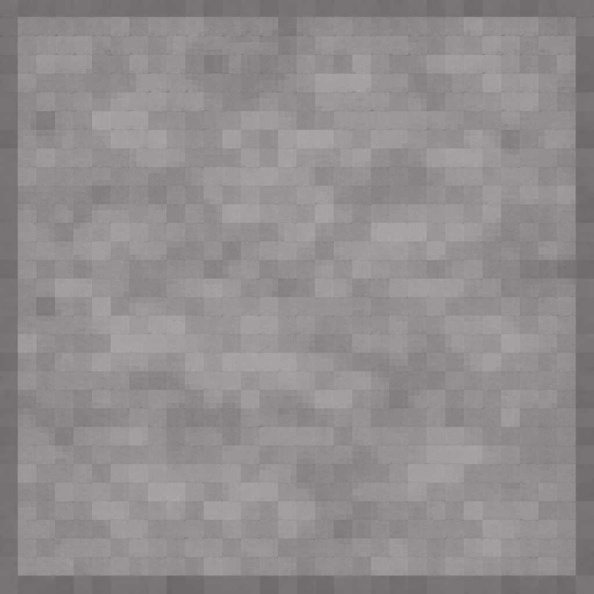
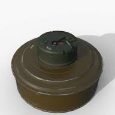
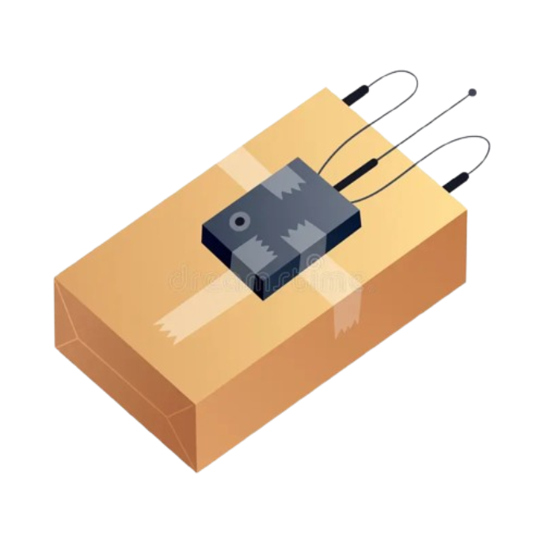
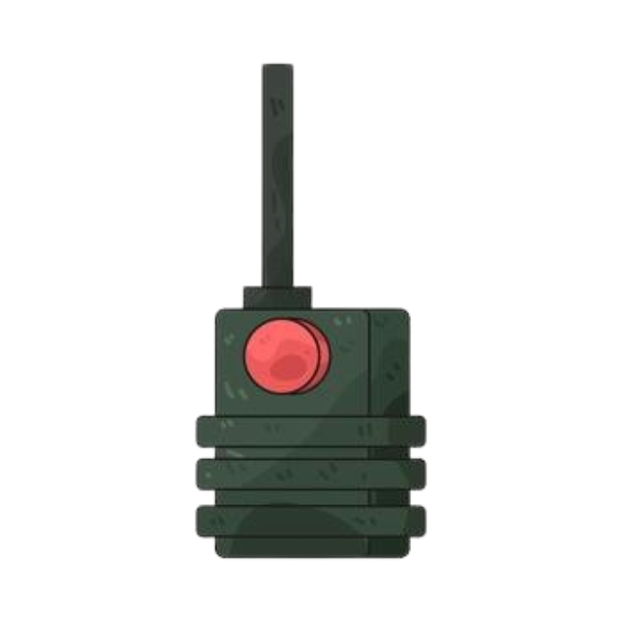
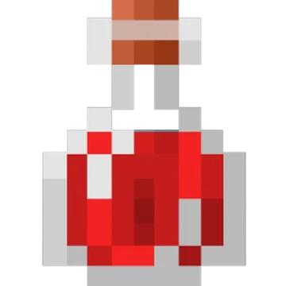

# 💣 Bomberman Deluxe - Raylib C++

An **enhanced Bomberman game** for two players with **many unique items**, power-ups, and special abilities. Unlike the classic Bomberman, this version features remote bombs, mines, a ghost mode, and much more!


## 🎮 Features

### 👥 Local Multiplayer (One Keyboard)
Play against your friend on **a single keyboard** - perfect for LAN parties or cozy gaming sessions!

### 🎯 Items & Power-Ups (More than the original!)

| Item | Icon | Effect |
|------|------|--------|
| **Bomb Upgrade** |  | Increases explosion range |
| **Bomb Count** |  | +1 max bomb capacity |
| **Stone** |  | Places temporary walls |
| **Mine** |  | Becomes invisible + explodes on contact |
| **Remote Bomb** |  | Placeable, explodes only via detonator |
| **Detonator** |  | Detonates all your remote bombs |
| **Healing Potion** |  | Restores 10 HP |
| **Ghost Mode** |  | 10 seconds: walk through walls |
| **smokeBomb** |  | makes a smoke claude |

## 🎮 Controls

### Player 1 (Blue)
| Action | Key |
|--------|-----|
| Movement | `W` `A` `S` `D` |
| Place Bomb | `Q` |
| Use Item | `E` |
| Inventory prev/next | `2` / `3` |

### Player 2 (Red)
| Action | Key |
|--------|-----|
| Movement | `I` `J` `K` `L` |
| Place Bomb | `U` |
| Use Item | `O` |
| Inventory prev/next | `8` / `9` |

### General
| Action | Key |
|--------|-----|
| Change Map Size | `V` |

## 🖼️ Inventory Display

Each player's inventory is shown above them with **icons**:
- The **currently selected item** is highlighted with a yellow frame
- Item count is displayed at the bottom right of each icon
- Scroll through items using `2/3` (P1) or `8/9` (P2)

## 📦 Installation

### Option 1: Pre-built Release (Easy)
1. Download the latest ZIP file from [GitHub Releases](https://github.com/Hannes-swd/Bomberman/releases)
2. Extract the ZIP file
3. Run `Bomberman.exe` directly (the `img` folder must be in the same directory!)

### Option 2: Build from Source
```bash
# Clone repository
git clone https://github.com/Hannes-swd/Bomberman.git
cd Bomberman

# Create CMake build folder
mkdir build && cd build

# Configure project
cmake ..

# Compile
cmake --build .

# Create export version (with all assets)
cmake --build . --target ExportGame
